# Welcome to the TasteBuds - a Recipe Suggestion App

## Overview
TasteBuds is a user-friendly application designed to help students and busy individuals decide what to cook with the ingredients they have. It simplifies meal planning by providing recipe suggestions and generating shopping lists for selected dishes.
### Features
* **Ingredient-Based Recipes**: Suggests recipes based on the ingredients you input.
* **Pantry Storage:** Stores user's ingredients with the ability to update.
* **Easy Navigation:** User-friendly design for quick access to recipes.
* **Recipe Details:** Provides nutritional information, and ingredient lists.
### Features in progress
* **Pantry Addition:** Allows users to add new ingredients to their pantry
* **Shopping Cart:** Allow users to automatically add missing ingredients to their shopping cart

## Setting up the Project
### There are multiple steps in setting this project up. Please read through each step carefully and we'll get started together!  

## Setting up SSMS (SQL Server)
### Step 1: Install and Set Up SQL Server Management Studio (SSMS)
To manage the SQL Server database, you will need to install SQL Server Management Studio (SSMS), a powerful tool for querying, designing, and administering yoru database.
1. Visit the official [SQL Server Management Studio (SSMS) download page](https://docs.microsoft.com/en-us/sql/ssms/download-sql-server-management-studio-ssms).
2. Click on **Download SSMS** and follow the installation prompts to install SSMS on your computer.
3. After installation is complete, launch SSMS.

### Step 2: Connect to the Local Server
1. In the **Connect to Server** window, type **.** (period) in the **Server name** field to connect to your local SQL Server instance.
2. Choose **Windows Authentication** as the authentication method (default option) if you're using your Windows credentials to connect.
3. Click **Connect**.

### Step 3: Create the local database and assign a user
1. Once connected, you should see the **Object Explorer** window appear on the left.
2. Right click **Security** and click **New -> Login...**
3. In the **Login** field, type **TestUser**, select **SQL Server Authentication**, for the password type **passwd**, and uncheck **Enforce password policy**. When you are done. it shoud look like the picture below. Click **ok** when complete.

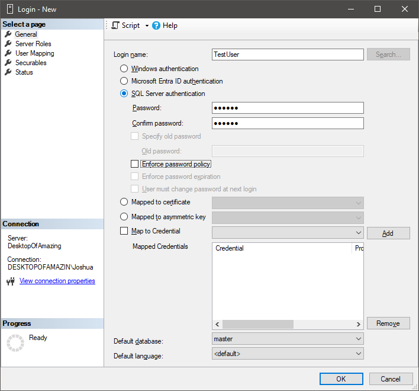

4. Back to the **Object Explorer**, right click on **Databases** and click **New Database...**
5. Under **Database name:** type **TasteBuds** and under **Owner:** type **TestUser**. When you are done, it should look like the picture below. Click **ok** when complete.

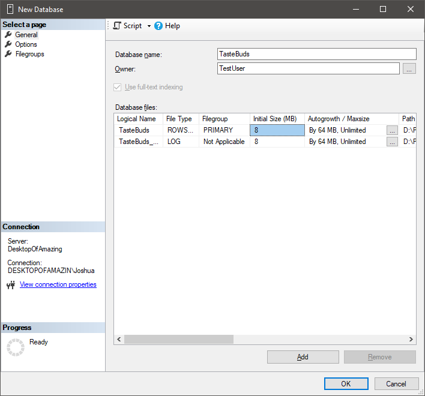

### Step 4: Reconnect to the database as TestUser
1. Right click **. (SQL Server...)** and click **Disconnect**
2. Click **Connect** and select **Database Engine...** The **Connect to Server** window should pop up again.
3. This time, enter the login details for **TestUser**. The Login is **TestUser** and Password is **passwd** the settings should match the picture below.

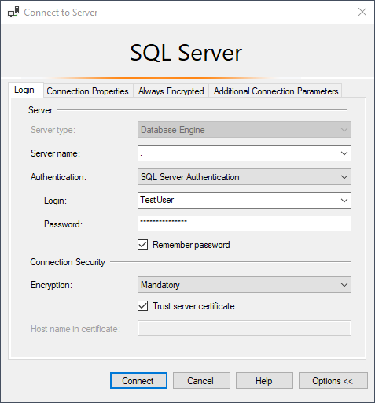

4. Before clicking connect, go to **Additional Connection Parameters** and enter the following in to the text field (picture for reference). Click **ok** when done.
```
Server=.;Initial Catalog=TasteBuds;User Id=TestUser;Password=passwd;Trusted_Connection=True;TrustServerCertificate=True;
```

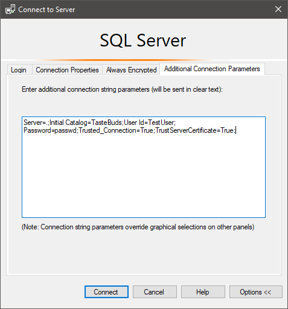

### Step 5: Populate the Database
1. Now that you are in the database as **TestUser**, we are going to create it. Press **Ctrl + O** in **SSMS** to open up `CreateTableQuery.sql` located in `TasteBuds\TasteBuds (SQL)`
2. Execute the query to create the basis of the database that our app will use.

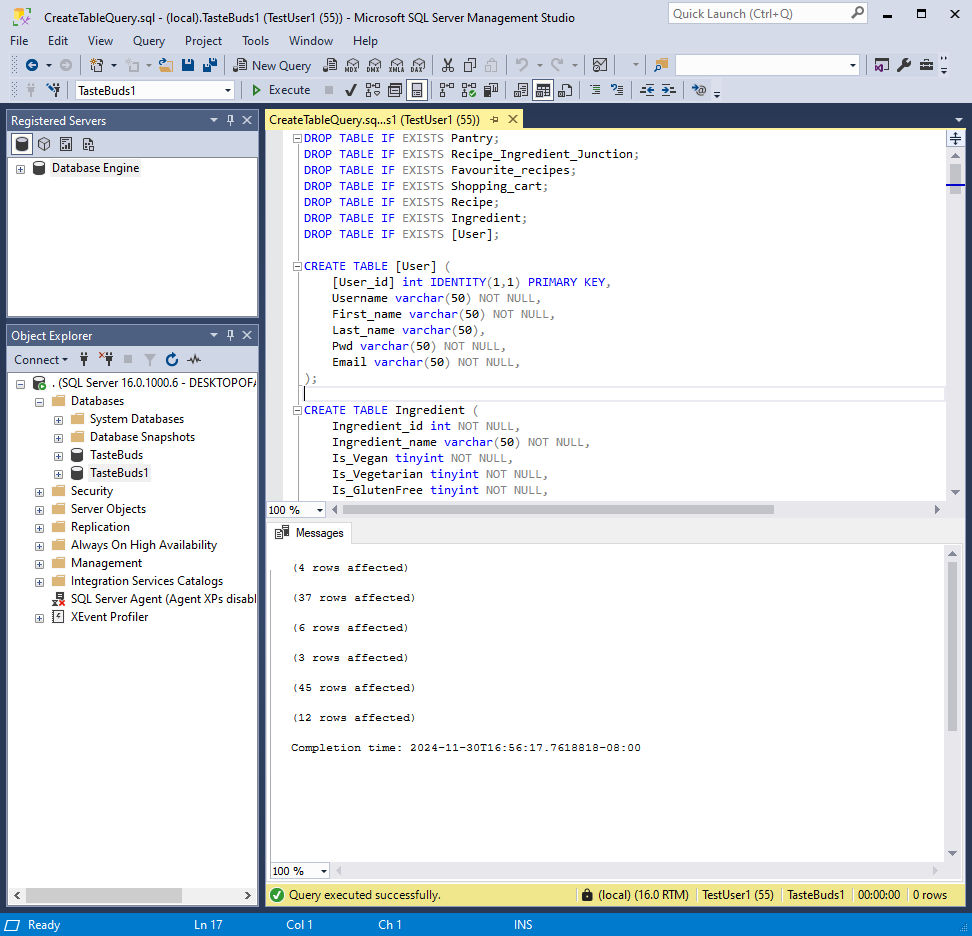

3. Congratulations! The SSMS database in now set up.


## Setting up the ASP.NET Core API
### Step 1: Install and Setup Visual Studio
To begin development of the Recipe Suggestion App, you will need to install **Visual Studio**, which includes support for **ASP.NET** applications.
1. Visit the official [Visual Studio download page](https://visualstudio.microsoft.com/downloads/).
2. Select the **Community** edition (free for individual use).
3. Run the installer and choose the **ASP.NET and web development** workload. This will include:
   - **ASP.NET Core**
   - **C#** language support
   - **Entity Framework Core**
4. Complete the installation process, it may take some time depending on your internet connection and system configuration.
5. Once the installation is complete, launch **Visual Studio**.

### Step 2: Open the TasteBudsAPI project
1. In Visual Studio's start page, click **Open a project or solution** and open the solution file `TasteBudsAPI.sln` located in `TasteBuds\TasteBuds (API)`

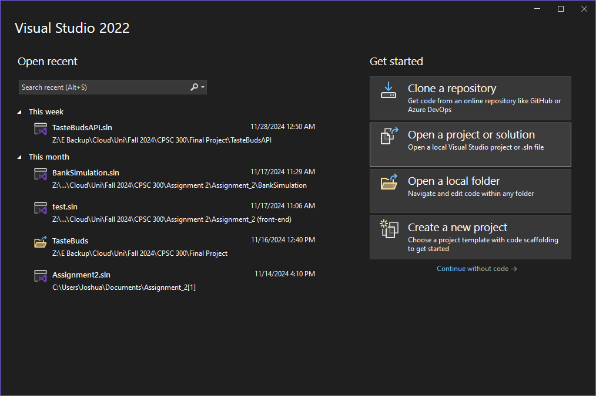

2. Press **F5** to start hosting the API locally (`https://localhost:7067`). You should see **This localhost page can't be found**. That is okay! This is a minimal API, so there are no front-end components for it. If you want to test it out, you can go to `https://localhost:7067/recipe`. A JSON object of recipes in our database should show up here.

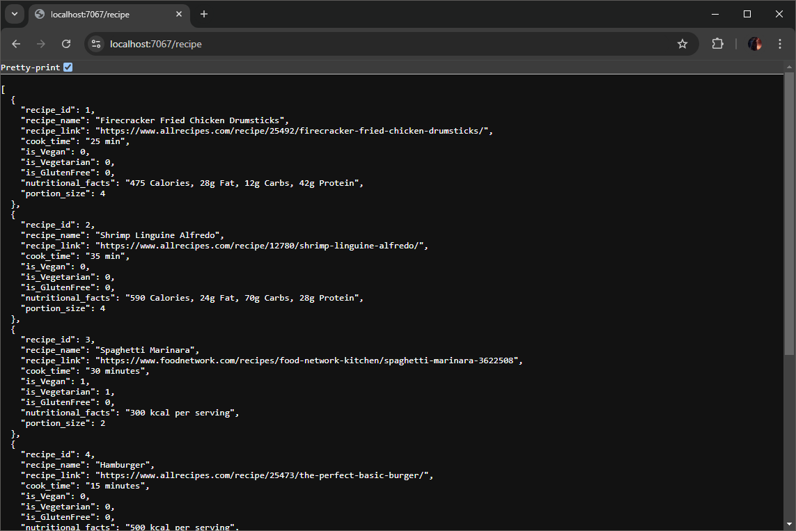

3. Congratulations! We are done setting up the TasteBudsAPI.

## Setting up the Front-End

### Step 1: Installing Angular
This project was created using [Angular CLI](https://github.com/angular/angular-cli) version 19.0.2.

1. To get started go to the project directory located in `TasteBuds\TasteBuds (Front-End)\taste-buds` and install angular:
```bash
npm install -g @angular/cli
```
2. Install the required packages for the project with
```bash
npm install
```

### Step 2: Starting the local development server for preview
1. First, we will build the project with
```bash
ng build
```
2. To start the local development server, run:
```bash
ng serve
```
3. In a web browser such as Google Chrome, open `https://localhost:4200`  
For the best experience, open developer mode with `F12` and toggle the device toolbar with `CTRL + SHIFT + M`  
From here, please select a device near the top of your screen.  
An example is shown below:  

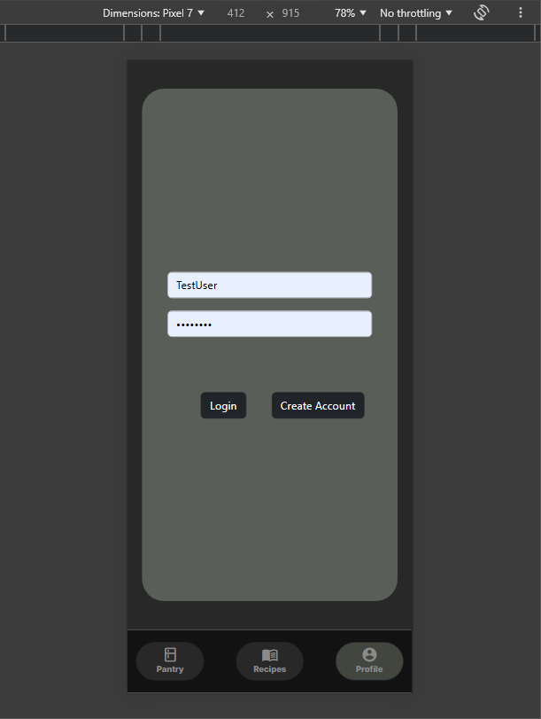

### Step 3: Testing the app
1. For full testing of the app, please use the login:  
Username: `TestUser`  
Password: `password`  
  
Feel free to create your own account, however please note that the pantry feature does not yet allow users to add items. This limits the functionality for new users.  

## Deployment to Android

To deploy to android, run:  
However, please note that we were unable to get our API to receive requests from external devices.
This means that the main functionality on the android app does not yet work. For this reason, we recommend
testing TasteBuds out on the web client in developer mode.  
```bash
ng build
npx cap sync
npx cap run android
```
## App Showcase
Login Screen | Register Screen | Profile Screen | Pantry Screen
--- | --- | --- | ---
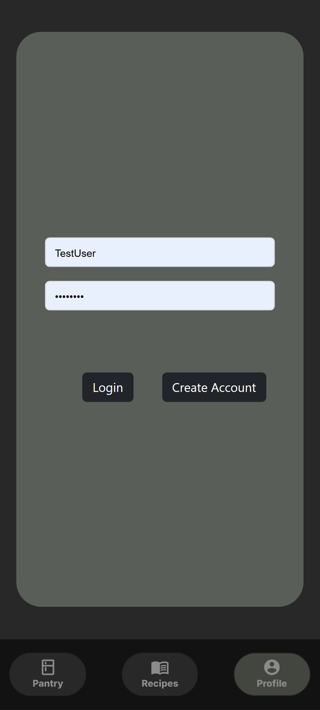 | 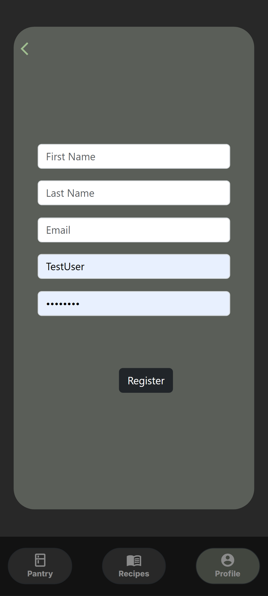 | 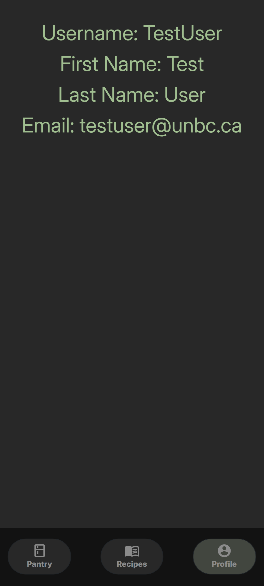 | 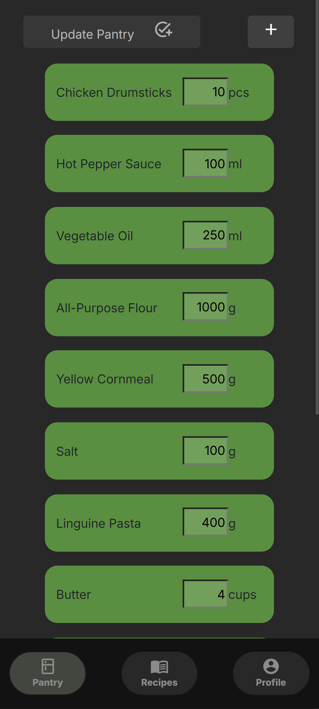

Recipes Screen | Recipe Info Screen | Filter Dropdown | Filtered Recipes
--- | --- | --- | ---
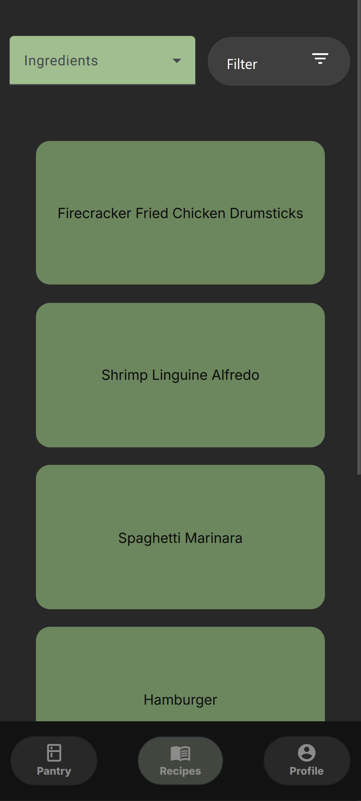| 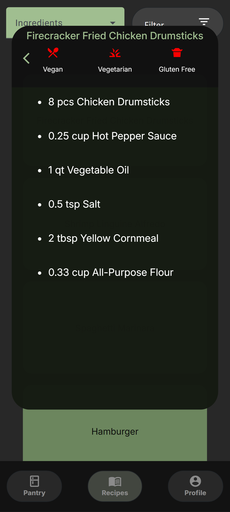 | 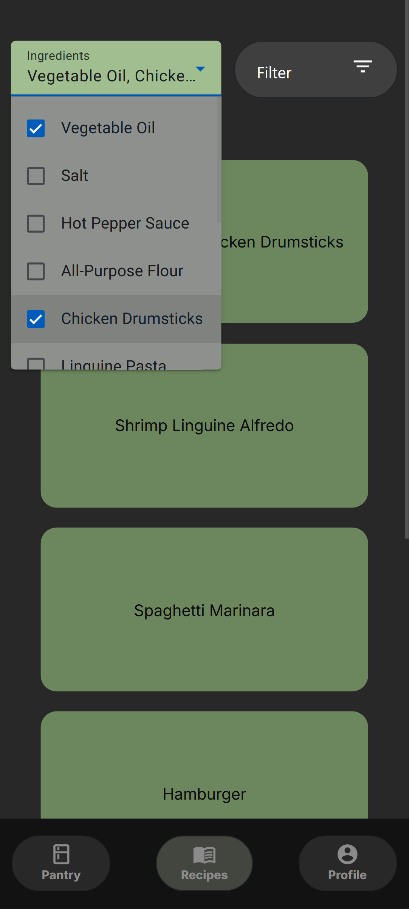 | 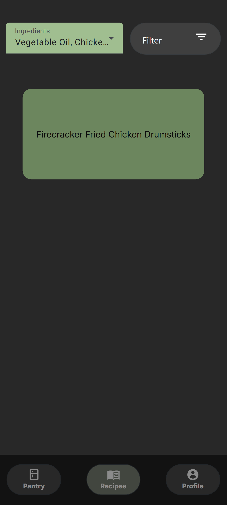 |

